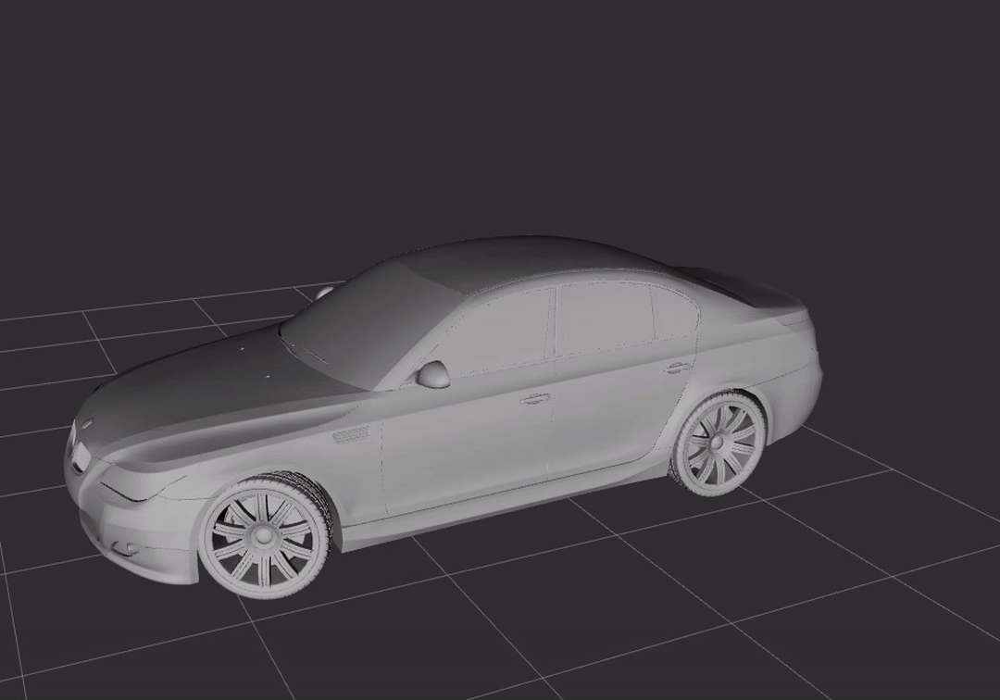

# Rviz Tool Cursor

An Rviz tool that visualizes a given geometry as the cursor and orients the object normal to objects in the scene. On a click of the left mouse button, the
tool will publish the point in 3D space of the object on which the cursor rests

The base class of the tool cursor has the following properties:

- `Topic`: The topic on which to publish the 3D point in the Rviz environment when the left mouse button is clicked
- `Patch Size`: The number of pixels on a side with which to create a patch used for estimated the surface normal
- `Color`: The color of the cursor visualization

## Implementations
### Mesh Tool Cursor

The mesh tool cursor visualizes a specified mesh file (.stl or .ply) as the cursor. The tool has the following implementation-specific properties:
- `Mesh Filename`: The filename of the mesh file to be displayed (supports package:// and file:// URIs)

### Circle Tool Cursor

The circle tool cursor visualizes a 2D circle of specified radius as the cursor. The tool has the following implementation-specific properties:
- `Radius`: The radius of the circle visualization

## Customization

In order to create a custom Rviz tool cursor, the `ToolCursor` base class requires the implementation of two pure virtual functions which define the behavior of the cursor visualization:
- `virtual Ogre::MovableObject* createToolVisualization() = 0`
  - Creates the Ogre visualization of the tool cursor
- `virtual void updateToolVisualization() = 0`
  - A Q_SLOT that is called when the relevant tool properties are changed. This function should handle changes that can be made via properties to the Ogre
  visualization of the cursor tool
